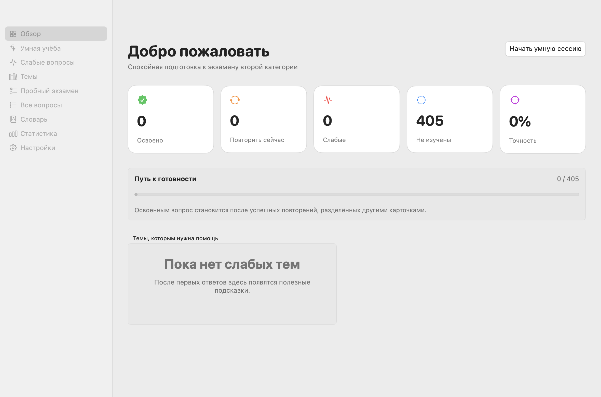

# HAM Trainer

Нативный офлайн‑тренажёр для подготовки к квалификационному экзамену радиолюбителя второй категории в России.


HAM Trainer написан на SwiftUI и работает без аккаунта, сети, телеметрии и API‑ключей. В приложении находятся 405 вопросов второй категории, обучение с повторением по расстоянию между вопросами, пробный экзамен, персональные заметки и подробные объяснения на русском языке.



## Возможности

- умная очередь без календарных интервалов: `5 → 10 → 20 → 40 → 80` отвеченных карточек;
- строгий приоритет ошибок, слабых и созревших карточек — освоенный, но ещё не созревший материал не подмешивается;
- отложенный повтор ошибки только после пяти других вопросов и лимит появлений в сессии;
- 30 уникальных вопросов на пробном экзамене, порог 25/30 и отдельный учёт неверных и неотвеченных;
- 405 коротких, начальных и пошаговых объяснений с разбором каждого неверного варианта;
- 142 встроенных термина, персональный глоссарий, заметки, состояния «непонятно/изучено» и тематический повтор;
- 24 отдельные схемы без подсвеченного ответа, поиск, фильтры, закладки и отметка трудных вопросов;
- локальная статистика, резервная копия JSON и безопасный импорт с проверкой до изменения данных;
- светлая и тёмная темы macOS.

## Быстрый старт

Требуются macOS 14+, Xcode Command Line Tools или Xcode со Swift 6. Для повторного импорта нужны Python 3, Poppler (`pdftotext`, `pdftoppm`) и системная утилита macOS `sips`.

```bash
git clone https://github.com/Leo0742/HAM-Trainer.git
cd HAM-Trainer

Tools/run_tests.sh
Tools/build_app.sh
open "Build/HAM Trainer.app"
```

Скрипт создаёт release‑пакет `.app`, иконку и локальную ad‑hoc подпись. Также можно открыть `HAMTrainer.xcodeproj` и запустить схему `HAMTrainer` в Xcode.

## Как устроено обучение

После каждого завершённого ответа увеличивается общий `studyStep`. Следующее повторение назначается не на дату, а после 5, 10, 20, 40 или 80 других завершённых карточек. Поэтому закрытие приложения, смена часового пояса и пропуск нескольких дней не меняют учебную дистанцию.

Неправильный ответ, «Не знаю» и просмотр ответа до попытки считаются ошибками. В обычной сессии карточка может вернуться лишь после пяти других вопросов и появиться не более двух раз. При срыве освоенный вопрос снова становится слабым и проходит лестницу заново. Smart Study показывает причину выбора карточки и не заполняет пустую очередь неготовыми освоенными вопросами.

Данные автоматически сохраняются в:

```text
~/Library/Application Support/HAMTrainer/progress-v1.json
```

Имя файла сохранено для совместимости; внутри используется схема 2. Старые данные мигрируют при чтении. Экспорт и импорт находятся в **Настройки**, а повреждённая резервная копия не заменяет текущий прогресс.

## Контент и воспроизводимость

Вторая категория представлена диапазонами `1–38`, `47–98`, `100–374` и `387–426` — ровно 405 вопросов. Конвейер намеренно разделён:

1. `Tools/import_questions.py` извлекает точные формулировки, варианты и ссылки на страницы в `ContentRaw/`;
2. `Tools/build_content.py` формирует учебные слои и глоссарий;
3. `ContentOverrides/question-overrides.json` применяется последним и переживает повторный импорт;
4. `Tools/extract_figures.py` создаёт отдельные фрагменты схем без печатного красного ответа;
5. `Tools/validate_content.py` и `Tools/audit_content.py` проверяют весь банк и создают отчёт.

```bash
python3 Tools/import_questions.py \
  --reference ExamSources/Справочник_КЭ.pdf \
  --guide ExamSources/radiolyubitel_2_category_guide_2026.pdf
python3 Tools/audit_content.py
```

Текущий аудит: 405/405 начальных объяснений, 405/405 пошаговых объяснений, 405/405 полных разборов неправильных вариантов, 405/405 ссылок на источник, 142 термина и 24 схемы. Подробности: [`docs/content-audit.md`](docs/content-audit.md), [`docs/content-format.md`](docs/content-format.md) и [`docs/source-provenance.md`](docs/source-provenance.md).

## Исходные материалы

Полные полученные для проекта PDF сохранены в `ExamSources/`, а обрезанные учебные схемы — отдельно в `Content/diagrams/questions/`. Метаданные, контрольные суммы, авторство и точные публичные URL приведены в [`ExamSources/README.md`](ExamSources/README.md). Репозиторий не объявляет эти документы свободными и не присваивает им лицензию исходного кода.

## Проверка

```bash
Tools/run_tests.sh
```

Набор из 27 проверок покрывает лестницу 5/10/20/40/80, перезапуск и границы сессий, запрет раннего показа, лимиты повторов, причины выбора, пробный экзамен, заметки, глоссарий, резервные копии и все 405 записей. `Tools/build_app.sh` выполняет release‑сборку и подпись; результат дополнительно проверяется `codesign --verify --deep --strict`.

## Структура

```text
HAMTrainer/             SwiftUI-приложение, состояние и планировщик
Content/                итоговый банк, глоссарий, темы, схемы и карта источников
ContentRaw/             воспроизводимый результат извлечения из PDF
ContentOverrides/       ручные исправления, применяемые последними
ExamSources/            полные исходные PDF и сведения о происхождении
Tools/                  импорт, обогащение, аудит, тесты и сборка
Tests/                  нативный тестовый runner без внешних зависимостей
docs/                   архитектура, планировщик, формат и отчёты
```

## Конфиденциальность и права

Приложение не выполняет сетевых запросов. Весь пользовательский прогресс остаётся на Mac. Лицензия на исходный код пока не объявлена. Учебные PDF и извлечённые изображения принадлежат соответствующим авторам/правообладателям; сведения об их происхождении — в `ExamSources/README.md`.
